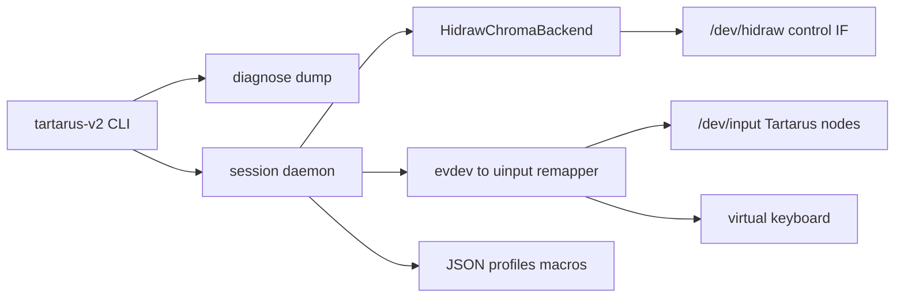

# Standalone Tartarus V2 Userspace Driver (Ubuntu 26)

> **Status:** Design proposal for stakeholder review. Implementation has not started.

**Overview:** Build a standalone userspace Tartarus V2 stack for Ubuntu 26 (RGB, remapping, macros, profiles) with a single paste-ready diagnose command for Windows↔Linux remote debugging. No OpenRazer runtime dependency.

## Context

- Device: Razer Tartarus V2 — USB **`1532:022B`** (RZ07-0227)
- HID layout: boot keyboard + keyboard + mouse (scroll); not a gamepad
- Chroma control uses Razer **90-byte** vendor HID reports (`transaction_id` typically **`0x1F`**), matrix **`4×6`**, brightness via **`ZERO_LED`** quirk
- Stock `usbhid` already delivers key events; this project owns vendor control + remapping
- OpenRazer lists Tartarus V2 for lighting, but this project **does not depend on it**. If `razerkbd` is bound on the test machine, diagnose will warn and provide unbind steps so our hidraw path can own the control interface.

## Architecture



**Language:** Python 3.12+ (readable logs, fast remote iteration; code authored on Windows, run on Linux).

**Runtime split:**

1. **Chroma backend** — open the control HID interface, send extended-matrix feature reports for effects, brightness, profile LEDs, custom frames
2. **Input remapper** — grab Tartarus evdev nodes, apply profile map + macros, emit via `uinput`
3. **Daemon** — load profile, apply lighting, run remap loop
4. **Diagnose** — first-class, paste-ready system dump

## Proposed repo layout

- `pyproject.toml` — package `tartarus-v2`, deps: `hidapi`, `evdev` (Linux-only extras)
- `src/tartarus_v2/` — CLI (`diagnose`, `daemon`, `set-effect`, `profile`)
- `src/tartarus_v2/hid/` — report framing, device discovery, chroma commands (protocol referenced from public OpenRazer sources only; no runtime dependency)
- `src/tartarus_v2/input/` — key ID table, remapper, macro engine
- `src/tartarus_v2/profiles/` — JSON load/save, default layout
- `src/tartarus_v2/diagnose.py` — remote debug dump
- `configs/default.json` — default profile
- `scripts/install-ubuntu.sh` — Ubuntu 26 deps, udev rules, groups, OpenRazer conflict check
- `README.md` — this design doc; post-implementation will also cover Linux install, Windows-dev workflow, and how to paste diagnose output

## Feature scope (v1)

| Area | Behavior |
|------|----------|
| Keys work | Usable as keyboard; remapper optional with shipped default profile |
| RGB | none, static, spectrum, wave, breath, reactive, starlight, custom frame; brightness 0–255 |
| Remap | all keypad keys + thumb stick directions + scroll / extra button to key or combo |
| Macros | sequenced keypresses with delays; bind to a key |
| Profiles | multiple named profiles; switch via CLI and a profile-switch key binding |
| Diagnostics | `tartarus-v2 diagnose` always available |

**Deferred** (after first Linux bring-up): Synapse hypershift parity, GUI tray, gamepad uinput.

## Debugging log (Windows develop, Linux test)

Single command on the Linux box:

```bash
tartarus-v2 diagnose --out ~/tartarus-diagnose.log
```

Prints the same content to stdout for copy-paste.

**Dump sections** (plain text, marked banners, paste-friendly):

1. Header — UTC time, tool version, hostname, `uname -a`, `/etc/os-release`
2. Device — `lsusb -d 1532:022b` summary, VID/PID match
3. HID inventory — hidraw nodes, interface numbers, driver owner (`razerkbd` vs `hid-generic`)
4. Input nodes — `/dev/input/by-id/*Tartarus*`, short capability list
5. Conflict check — OpenRazer present/bound; exact unbind steps if blocking
6. Permissions — `input`/`plugdev` groups, udev rule status
7. Live probe — open hidraw, firmware/serial if possible, safe get-report; **annotated hex** TX/RX (90-byte layout)
8. Optional `--listen 3` — 3s capture of physical key codes
9. Log tail — `~/.cache/tartarus-v2/tartarus-v2.log` + `dmesg` hid/razer snippets
10. Footer — `=== COPY FROM HERE ===` / `=== COPY TO HERE ===` banners

**Daemon logging:** `~/.cache/tartarus-v2/tartarus-v2.log` with `INFO`/`DEBUG`; HID hex and remap decisions when `--debug`. Diagnose always attaches a tail of that file.

## Ubuntu 26 install path

1. `scripts/install-ubuntu.sh` — packages, venv, `pip install -e .`
2. udev rule for `1532:022B` (hidraw + input access)
3. Document unbinding OpenRazer if it owns the control interface
4. Smoke: `tartarus-v2 diagnose` then `tartarus-v2 set-effect static --rgb FF0000`

## Implementation order

1. Scaffold package + CLI + **diagnose** first (Linux testing can start immediately)
2. HID discovery + report TX/RX + firmware/brightness
3. Lighting effects + profile LEDs
4. Key map + remapper (evdev to uinput)
5. Macros + multi-profile JSON
6. Daemon + install script + install/usage docs

## Success criteria

- Diagnose produces a self-contained pasteable log on Ubuntu 26 with the device plugged in
- RGB works without OpenRazer
- Remap + macro profile works in a desktop/game session
- Diagnose output can be pasted from Linux into the development chat so iteration continues from Windows
